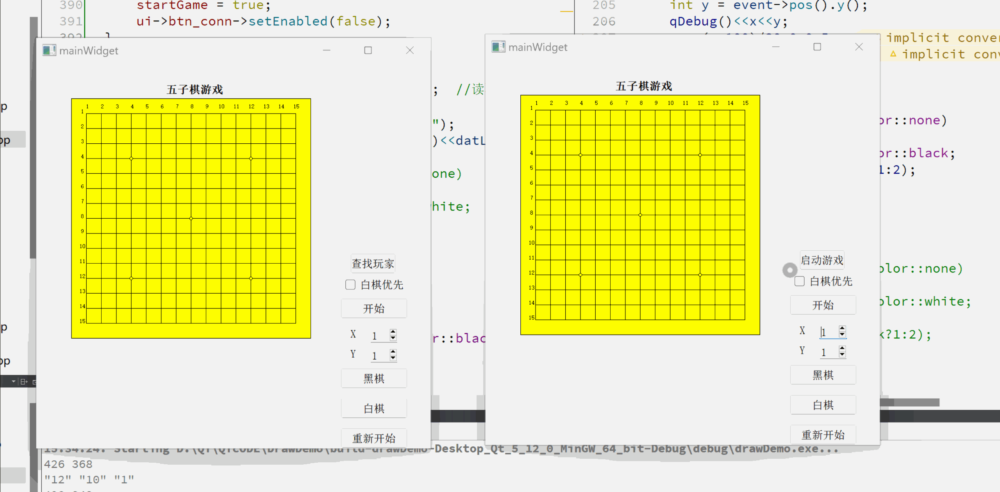

# -课上的项目：五子棋盘室

  首先，主要是用Qt中的Qpaint类实现棋盘界面设计
  期间利用二维数组来管理棋盘
  通过信号槽实现点击事件：
  通过检测落子的mousePressEvent函数来获取点击位置然后通过painter.drawEllipse来实现落子

  加入的drawserver文件：通过网络串口实现棋盘室，可以实现同网络下双设备下棋

  https://img-blog.csdnimg.cn/direct/2934941b3a6242cea491d785c8278bb5.gif
    
  
